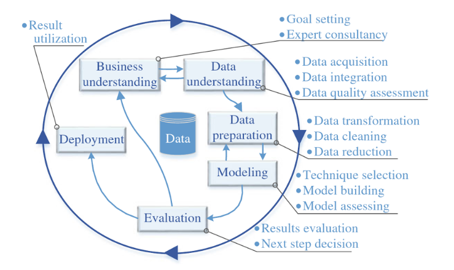

```{r setup, include=FALSE}
knitr::opts_chunk$set(echo = TRUE)
```


\hfill Relatório 3

\hfill Gustavo Henrique Fernandes Carvalho

\hfill Data: 30/05/2018

1. **Introdução**

A enorme quantidade de dados que temos a nossa disposição atualmente torna difícil a compreensão e extração de informações úteis, como é o caso dos dados de pesquisadores que estão espalhados em enormes bases.

Tendo isso em vista, esse projeto possui como objetivo analisar e estudar as bases de dados de publicações cientifica dos professores do curso de Direito da Universidade de Brasília.

O curso de Direito da Universidade de Brasília foi criado junto com a Universidade em 1962, dentro do Instituto Central de Ciências Humanas (ICCH) até a criação da Faculdade de Ciências Jurídicas e Sociais (FCJS), em 1967.

O curso de mestrado em Direito foi criado apenas em 1975. O curso de pós graduação em direito na Universidade de Brasília possui um grande foco em Direito e Estado, sendo referencia nacinal nos estudos de Direito Público.

Atualmente o curso de graduação é oferecido tanto no período diurno como noturno e os coordenadores dos cursos de cada período são, respectivamente, Professor Henrique Araújo Costa e a Professora Inez Lopes. O coordenador dos cursos de pós-graduação é o Professor Valcir Gassen.

A Faculdade de Direito da Universidade de Brasília tembém possui um periódico anual chamado Revista Direito.UnB no qual são publicados artigos de alunos e professores.


2. **Referencial**

A plataforma Lattes é um sistema desenvolvido e matido pelo Conselho Nacional de Desenvolvimento Científico e Tecnológico (CNPq), que contém uma enorma base de dados com informações referentes a produção científica brasileira. Nessa plataforma podemos encontrar informações de instituições de pesquisa, pesquisadores e produção.

A plataforma é muito utilizada por pesquisadores e por instituições para acompanhar o que está sendo produzido no país. Porém como a enorma quantidade de dados presente na plataforma torna difícil a extração de informações úteis.

Além da plataforma Lattes temos duas outras grandes fontes de informação sobre a produção científica no Brasil, o OASIS e o BDTD.

O OASIS é um portal de acesso aberto de publicações científicas brasileiras, ele é matido pelo Instituto Brasileiro de Informação em Ciência e Tecnologia (IBICT). Ele permite a busca de produção científica de acordo com os autores e por vinculo de instituições.

A Biblioteca Digital Brasileira de Teses e Dissertações (BDTD) também possui um grande acervo de produções científicas, ela é mantida pelo Instituto Brasileiro de Informação em Ciência e Tecnologia (IBICT). O projeto do BDTD teve como objetivo incentivar o registro de teses e dissertações em meios eletrônicos, para isso o portal ajuda a divulgação dos projetos tanto na comunidade científica brasileira como no exteriro.

3. **Metodologia**

A metodologia utilizada no processamento dos dados foi a Cross Industry Standard Process for Data Mining (CRISP-DM), que consiste em um fluxo de processamento de dados que está sendo muito utilizado no processamento de Big Data por normalmente ajudar na geração de bons resultados de mineração de dados.

As ferramentas utilizadas na analise e tratamento dos dados foram a linguagem R e o RStudio, com as bibliotecas seguintes bibliotecas:
```{r echo=TRUE, message=FALSE, warning=FALSE, paged.print=FALSE}
library(jsonlite)
library(dplyr)
library(ggplot2)
library(tibble)
library(knitr)
library(kableExtra)
```



Como podemos observar na Figura 1, o fluxo de mineração de dados seguindo a metodologia CRISP-DM é dividido em seis etapas, descritas individualmente a seguir assim como elas foram aplicadas nesse projeto.

A. *Entendimento do negócio*

É nessa etapa que o profissional que estará analisando os dados deve procurar conhecer mais a respeito do ambiente no qual os dados foram obtidos para entender melhor o real significado dos dados que serão trabalhados.

Nesse projeto essa etapa consistiu em uma pesquisa a respeito do curso de Direito na universidade de Brasília e a conversa com por e-mail com professores do curso.

B. *Compreensão dos dados*

Nessa segunda etapa o objetivo é inspecionar, organizar e conhecer quais dados temos a nossa disposição para análise.

A bases de dados que serão utilizadas nesse projeto são a OASIS, BDTD e de publicações do curso de direito.

```{r echo=TRUE}
# Base de publicações por professores do curso de Direito da Universidade
# de Brasília
publicacoes <- fromJSON("Data/Direito.publication.json")

# Base de dados de publicações da Universidade de Brasília
oasis <- fromJSON("Data/oasisbr_unb all.json")

# Dados da Biblioteca Digital Brasileira de Teses e Dissertações
bdtd <- fromJSON("Data/unb.BDTD.json")
```

Nesse projeto a análise terá foco na base de dados *Direito.publication.json*, que contém informações de publicações dos professores do curso de Direito da Universidade de Brasília. As bases OASIS e BDTD também serão utilizadas mas apenas como forma de validar alguns dados da base de publicações além de eventualmente acrescentar alguns dados para a análise.

C. *Preparação dos dados*

Nessa etapa realizamos a limpeza dos dados para ser possível trabalharmos com eles nas próximas etapas, seguindo o padrão de 'tidy data'.

```{r echo=TRUE}
# Limpeza dos dados de publicações
periodicos <- tibble()
for (i in 1:length(publicacoes$PERIODICO))
  periodicos <- rbind(periodicos, publicacoes$PERIODICO[[i]])
livros <- tibble()
for (i in 1:length(publicacoes$LIVRO))
  livros <- rbind(livros, publicacoes$LIVRO[[i]])
capitulo_de_livros <- tibble()
for (i in 1:length(publicacoes$CAPITULO_DE_LIVRO))
  capitulo_de_livros <- rbind(capitulo_de_livros,
                              publicacoes$CAPITULO_DE_LIVRO[[i]])
texto_em_jornais <- tibble()
for (i in 1:length(publicacoes$TEXTO_EM_JORNAIS))
  texto_em_jornais <- rbind(texto_em_jornais,
                            publicacoes$TEXTO_EM_JORNAIS[[i]])
eventos <- tibble()
for (i in 1:length(publicacoes$EVENTO))
  eventos <- rbind(eventos, publicacoes$EVENTO[[i]])
artigos_aceitos <- tibble()
for (i in 1:length(publicacoes$ARTIGO_ACEITO))
  artigos_aceitos <- rbind(artigos_aceitos, publicacoes$ARTIGO_ACEITO[[i]])
demais_publicações <- tibble()
for (i in 1:length(publicacoes$DEMAIS_TIPOS_DE_PRODUCAO_BIBLIOGRAFICA))
  demais_publicações <- rbind(demais_publicações,
                  publicacoes$DEMAIS_TIPOS_DE_PRODUCAO_BIBLIOGRAFICA[[i]])


# Limpeza dos dados do BDTD
bdtd.tidy <- as.tibble(bdtd$response$docs)
bdtd.tidy$author <- unlist(bdtd.tidy$author)
```


D. *Modelagem*

É nessa etapa que a mineração dos dados ocorre de fato, iniciamos com uma análise preditiva das possíveis relações dos dados e com uma análise mais profunda as predições iniciais podem ser validadas, além de termos novos insights a respeito dos dados durante esse processo de validação.

E. *Avaliação*

A avaliação é uma validação mais qualitativa que quantitativa, isto é, uma validação se os resultados obtidos na modelagem são realmente úteis. Essa etapa é essencial quando a análise dos dados está sendo feita para um cliente, pois com ela os cientistas de dados podem ter uma ideia melhor se os resultados das análises estão de acordo com o que o cliente espera.

F. *Desenvolvimento*

Agora com todas as validações e ultimos ajustes nos algoritmos de análise dos dados, o modelo de mineração finalmente pode começar a ser aplicado em soluções de problemas reais.

4. **Resultados**

Nessa seção são apresentados os resultados obtidos nessa etapa do projeto assim como uma explicação mais profunda e demostrativa dos dados utilizados.

A primeira observação que podemos fazer é que os professores de direto tiveram apenas 4 artigos aceitos como mostrado a seguir.

```{r}
subset(artigos_aceitos, select=c("ano", "titulo", "periodico")) %>%
  kable() %>%
  kable_styling() %>%
  column_spec(2:3, width = "17em")
```

Isso se deve a produção científica do Direito ser mais focada em publicações e principalmente e na produção de capítulos de livros, se diferenciando da produção em outros cursos das áreas de Engenharia e Infomatica que publicam muitos artigos.

Agora focando mais nos capítulos de livros produzidos, a primeira análise inicial que temos é na quantidade de capítulos de livros produzidos por ano entre 2010 e 1017.

```{r echo=TRUE}
capitulo_de_livros %>%
  group_by(ano) %>%
  summarise(n = n()) %>%
  ggplot(aes(x = ano, y = n)) +
  geom_bar(position = "stack", stat = "identity", fill = "steelblue")+
  geom_text(aes(label=n), vjust=-0.3) +
  ylab("Número de capítulos de livros produzidos")
```


O curso de direito também produz muitas publicações em periódicos, então realizando a mesma análise por ano como feita com os capítulos de livros, para podermos comparar os dois tipos de produção, temos o seguinte resultado.
```{r echo=TRUE}
periodicos %>%
  group_by(ano) %>%
  summarise(n = n()) %>%
  ggplot(aes(x = ano, y = n)) +
  geom_bar(position = "stack", stat = "identity", fill = "steelblue")+
  geom_text(aes(label=n), vjust=-0.3) +
  ylab("Número de periódiocos produzidos")
```

Por esse gráficos podemos observar que a produção anual de periódicos e capítulos de livros são bem próximas, com exceção apenas do ano de 2010 e 2011, quando a produção de periódicos e capítulos de livros foram bem menores que nos outros anos.

Voltando nossa análise para os capítulos de livros produzidos, podemos observar o nível de internacionalização dessas produções, isto é, quantos livros foram publicados em cada pais.

```{r echo=TRUE}
subset(capitulo_de_livros, select=c("pais_de_publicacao", "ano")) %>%
  group_by(pais_de_publicacao) %>%
  summarise(n = n()) %>%
  data.frame %>%
  arrange(desc(n)) %>%
  kable(col.names=c("País de publicação", "Número de capítulos de livro")) %>%
  kable_styling()
```

Podemos observar que temos poucas publicações internacionais do curso de Direito. Após pesquisar sobre o assunto e conversar com alguns alunos do curso de Direito para tentar entender porque isso ocorre, o principal motivo encontrado é que produções como capítulos de livro e publicações normalmente estão muito atrelados ao sistema Jurídico de um país espcífico.

Continuando a análise do nível de internacionalização, mas agora análisando as produções que foram para enventos temos o seguinte resultado.

```{r echo=TRUE}
ggplot(data = eventos) +
  geom_bar(mapping = aes(x = ano_do_trabalho, fill = classificacao)) +
  xlab("Ano") +
  ylab("Número de eventos")
```

Nessa análise podemos observar que diferentemente das publicações internacionais de capítulos de livros, uma quantidade consideravel das participações em eventos de professores do Direito são em eventos internacionais. 
