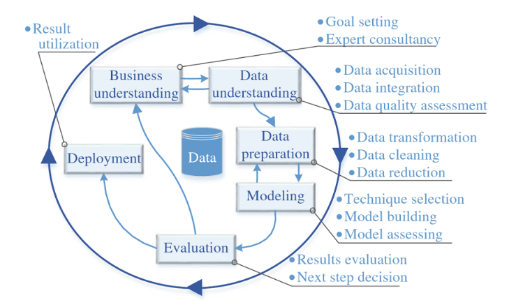

```{r setup, include=FALSE}
knitr::opts_chunk$set(echo = TRUE)
```

# Introdução

A ciência de dados, cada vez mais, ganha espaço e importância no âmbito tecnológico por ser uma área que pode agregar uma quantidade de informações à qualquer área muito interessante. É como disse o Jeff Weiner, CEO do LinkedIn, “Os dados realmente impulsionam tudo o que fazemos”. 

A enorme quantidade de dados que temos a nossa disposição atualmente torna difícil a compreensão e extração de informações úteis, como é o caso dos dados de pesquisadores que estão espalhados em enormes bases.

E devido à grande quantidade de informação que se é obtida nos dias atuais, surgiu um campo da ciência responsável por tratar esse conhecimento que é adquirido e armazenado. Essa área responsável pelo tratamento de dados é conhecida como Ciência de Dados, que combina Big Data com mineração de dados, de modo que grandes quantidade de informações sejam tratadas a fim de identificar padrões, regras, relacionamentos ou apenas para poder analisar esses dados de uma maneira mais clara.

Então, a partir de toda essa base que a ciência de dados nos dá e nos proporciona, foi analisado dados de currículos lattes dos professores da Universidade de Brasília, mais especificamente do curso de Comunicação, afim de avaliar a produção científica deles, contextualizar e realizar uma primeira análise sobre o programa de pós-graduação dos cursos de Direito, Ciência da Informação e Comunicação.


#CRISP-DM

A metodologia utilizada no processamento dos dados foi a Cross Industry Standard Process for Data Mining (CRISP-DM), que consiste em um fluxo de processamento de dados que está sendo muito utilizado no processamento de Big Data por normalmente ajudar na geração de bons resultados de mineração de dados.

As ferramentas utilizadas na analise e tratamento dos dados foram a linguagem R e o RStudio, com as bibliotecas seguintes bibliotecas:
```{r echo=TRUE, message=FALSE, warning=FALSE, paged.print=FALSE}
library(jsonlite)
library(dplyr)
library(ggplot2)
library(tibble)
library(knitr)
library(kableExtra)
```



Como podemos observar na Figura 1, o fluxo de mineração de dados seguindo a metodologia CRISP-DM é dividido em seis etapas, descritas individualmente a seguir assim como elas foram aplicadas nesse projeto.

A. *Entendimento do negócio*

É nessa etapa que o profissional que estará analisando os dados deve procurar conhecer mais a respeito do ambiente no qual os dados foram obtidos para entender melhor o real significado dos dados que serão trabalhados.

Nesse projeto essa etapa consistiu em uma pesquisa a respeito dos cursos de Direito, Ciência da Informação e Comunicação na universidade de Brasília e a conversa com por e-mail com professores dos cursos.

B. *Compreensão dos dados*

Nessa segunda etapa o objetivo é inspecionar, organizar e conhecer quais dados temos a nossa disposição para análise.

A bases de dados que serão utilizadas nesse projeto são a OASIS, BDTD e de publicações dos cursos mencionados acima.


C. *Preparação dos dados*

Nessa etapa realizamos a limpeza dos dados para ser possível trabalharmos com eles nas próximas etapas, seguindo o padrão de 'tidy data'.


D. *Modelagem*

É nessa etapa que a mineração dos dados ocorre de fato, iniciamos com uma análise preditiva das possíveis relações dos dados e com uma análise mais profunda as predições iniciais podem ser validadas, além de termos novos insights a respeito dos dados durante esse processo de validação.

E. *Avaliação*

A avaliação é uma validação mais qualitativa que quantitativa, isto é, uma validação se os resultados obtidos na modelagem são realmente úteis. Essa etapa é essencial quando a análise dos dados está sendo feita para um cliente, pois com ela os cientistas de dados podem ter uma ideia melhor se os resultados das análises estão de acordo com o que o cliente espera.

F. *Desenvolvimento*

Agora com todas as validações e ultimos ajustes nos algoritmos de análise dos dados, o modelo de mineração finalmente pode começar a ser aplicado em soluções de problemas reais.


# CRISP-DM Fase 1 - Entendimento do Negócio

##O que é o Sistema Nacional de Pós-Graduação? (Contextualização)

A produção do conhecimento científico, no Brasil, é predominantemente efetuada por meio do Sistema Nacional de Pós-Graduação - SNPG, e mais fortemente relacionada com a formação de doutores nesse sistema (Pátaro e Mezzomo, 2013), por meio de cursos de pós-graduação _strictu sensu_. 

Fernandes e Sampaio (2017) já indicaram que a ciência é reconhecidamente um elemento essencial para o desenvolvimento social e econômico de qualquer nação.
Assim sendo, faz-se mister aprimorar o SNPG como forma de promoção desse crescimento, visando maximizar o retorno decorrente do emprego dos recursos nele aplicados. 
A promoção do crescimento do SNPG se dá predominantemente por meio de avaliações regulares de seus programas de pós-graduação, sob responsabilidade da CAPES, que realiza a cada quatro anos um complexo (Leite, 2018, p. 13) e custoso processo de coleta de dados, análise e deliberação sobre as pós-graduações _strictu sensu_, em coerência com o estabelecido no Plano Nacional de Pós-Graduação (PNPG) 2012-2020 (CAPES, 2010) e nos diversos documentos que definem os critérios de organização da pós-graduação em cada área do conhecimento (CAPES, 2018).
Leite (2018) faz uma apresentação geral  de como se organizam e são avaliadas as pós-graduações no Brasil.

O Plano Nacional de Pós-Graduação (PNPG), por outro lado, define diretrizes estratégicas para desenvolvimento da pós-graduação brasileira, que deve abordar prioritariamente grandes temas de interesse nacional, tais como a redução das assimetrias de desenvolvimento entre as regiões do Brasil, a formação de professores para a educação básica, a formação de recursos humanos para as empresas, a resposta aos grandes desafios brasileiros sobre Água, Energia, Transporte, Controle de Fronteiras, Agronegócio, Amazônia, Amazônia Azul (Mar), Saúde, Defesa, Programa Espacial, além de Justiça, Segurança Pública, Criminologia e Desequilíbrio Regional.
O PNPG também traça as diretrizes para financiamento da pós-graduação e sua internacionalização, apresentando conclusões e recomendações.

As avaliações do SNPG, ao atribuirem mensurações de desempenho às diversas pós-graduações que dele fazem parte, geram incentivos e penalidades aos programas, tendo em vista a limitada disponibilidade de recursos para investimento em bolsas, taxas de bancada etc.
Embora o sistema seja altamente sofisticado ele é também altamente criticado (Azevedo et al., 2016), sobretudo porque há percalços na busca por um equilíbrio entre as diferentes concepções de finalidade da ciência. 
Se de um lado a promoção do conhecimento gerado predominantemente nas ditas ciências _hard_ constribui para criar fluxos econômicos mais intensos, isso não significa que essa promoção possa ocorrer em detrimento da menor promoção na geração de conhecimento sobre problemas sociais, predominantemente gerado nas ditas ciências _soft_, especialmente das áreas de humanidades, sob pena de ampliação de desigualdades (Azevedo et al., 2016).

Não há solução simples, mas postula-se, nesta disciplina, que uma maior agilidade na avaliação e a utilização de critérios mais objetivos, poderá facilitar a melhoria do sistema.


##A UnB dentro do Sistema Nacional de Pós-Graduação (Contextualização)

### O que é a UnB?
A Universidade de Brasília (UnB) foi inaugurada, em 21 de abril de 1962, após dois anos da criação de Brasília. A criação da Universidade foi fruto do sonho e do trabalho de educadores como Darcy Ribeiro e Anísio Teixeira.

As regras, a estrutura e concepção da Universidade foram definidas pelo Plano Orientador, uma espécie de Carta Magna, datada de 1962, e ainda hoje em vigor. O Plano foi a primeira publicação da Editora UnB e mostra o espírito inovador da instituição. “Só uma universidade nova, inteiramente planificada, estruturada em bases mais flexíveis, poderá abrir perspectivas de pronta renovação do nosso ensino superior”, diz o Plano Orientador.

Hoje a Universidade de Brasília é formada por 4 campis, a Faculdade UnB Planaltina (FUP), a primeira fora do Plano Piloto, a Faculdade de Ceilândia (FCE) e a Faculdade do Gama (FGA) e o Campus Universitário Darcy Ribeiro.

A missão da Universidade é ser uma instituição inovadora, comprometida com a excelência acadêmica, científica e tecnológica formando cidadãos conscientes do seu papel transformador na sociedade, respeitadas a ética e a valorização de identidades e culturas com responsabilidade social.

###Descrição das pós-graduações da UnB

O programa de pós-gradução da faculdade de comunicação (FAC) é divido em dois grupos: mestrado e doutorado. Além disso, o Programa de Pós-Graduação em Comunicação da Faculdade de Comunicação da Universidade de Brasília (PPG/FAC/UnB) completou, em 2018, 44 anos de atividades ininterruptas de formação e pesquisa de excelência na área. Com um Mestrado consolidado, em atividade desde 1974, e um Doutorado de alto padrão, instalado em 2003, o PPG/FAC/UnB, por sua localização central, tem marcado sua atuação por uma forte inserção regional, nacional e mesmo internacional e pela formação de novos quadros qualificados para o ensino, a pesquisa e a extensão principalmente para as regiões Centro-Oeste e Norte. 

O Programa, a partir de suas quatro linhas de pesquisa, tem reconhecido destaque nos estudos da Comunicação e da Sociedade, com ênfase em epistemologia, teorias e tecnologias de comunicação, políticas de comunicação e de cultura (das quais é pioneiro no Brasil), jornalismo (com atualizado enfoque para as transformações estruturais) e estudos de linguagens e narrativas.
Os docentes são líderes de grupos de pesquisa e têm se dedicado a um intenso esforço de publicação em conjunto com os discentes do Programa e parceiros de pesquisa (o que pode ser atestado pelos indicadores quantitativos e qualitativos da produção intelectual).

Ao longo dos 43 anos de atividade do Mestrado e 14 anos de existência do Doutorado, o PPG/FAC/UnB formou 522 Mestres e 112 Doutores.

Já o curso de Direito da Universidade de Brasília foi criado junto com a Universidade em 1962, dentro do Instituto Central de Ciências Humanas (ICCH) até a criação da Faculdade de Ciências Jurídicas e Sociais (FCJS), em 1967.

O curso de mestrado em Direito foi criado apenas em 1975. O curso de pós graduação em direito na Universidade de Brasília possui um grande foco em Direito e Estado, sendo referencia nacinal nos estudos de Direito Público.

Atualmente o curso de graduação é oferecido tanto no período diurno como noturno e os coordenadores dos cursos de cada período são, respectivamente, Professor Henrique Araújo Costa e a Professora Inez Lopes. O coordenador dos cursos de pós-graduação é o Professor Valcir Gassen.

A Faculdade de Direito da Universidade de Brasília tembém possui um periódico anual chamado Revista Direito.UnB no qual são publicados artigos de alunos e professores.

E, por fim, o Programa de Pós–graduação em Ciência da Informação (PPGCInf), da Faculdade de Ciência da Informação (FCI), da Universidade de Brasília (UnB), visa aprofundar os conhecimentos adquiridos por graduados e pós-graduados em cursos superiores, regulamentados pelos órgãos competentes no Brasil, com interesses afins ao Programa, dando-lhes oportunidade de desenvolver competência científica e capacidade profissional e criadora em Ciência da Informação, formando pesquisadores, professores e profissionais de alto nível, aptos a desenvolver pesquisas e realizar inovações nesta área do saber. O PPGCInf tem como área de concentração: Gestão da Informação. O PPGCInf compreende os cursos de Mestrado Acadêmico e Doutorado (stricto sensu) na área de Ciência da Informação.

O Mestrado Acadêmico objetiva promover a competência científica de graduados, contribuindo para a formação de docentes e pesquisadores na área da informação. O Doutorado visa formar profissionais de alto nível, que possam atuar como pesquisadores autônomos e como docentes na área de Ciência da Informação, buscando: propiciar visão abrangente da área; desenvolver sólida base teórica relativa à área; estimular o desenvolvimento da produção científica da área, com projetos de pesquisa inovadores e socialmente relevantes.

A Linha de Pesquisa Organização da Informação busca propor conhecimentos nos níveis epistemológico, científico e prático relativos à origem, coleta, organização, estocagem, recuperação, interpretação, transmissão, transformação e uso da informação. Neste contexto, relaciona-se com a natureza da informação, a terminologia e modelos de tratamento e recuperação de informações; as necessidades dos usuários de informação e suas implicações; a identificação dos recursos necessários a partir dos tipos e formatos; a identificação, o tratamento e a recuperação de informações adequadas para o usuário; a formulação de políticas, estratégias, planejamentos, normas e processos relacionados a diferentes espaços de informação.

A Linha de Pesquisa Comunicação e Mediação da Informação reúne estudos que buscam conhecimentos nos níveis epistemológico, científico e prático sobre processos de comunicação em diversos contextos e setores da sociedade. Os estudos desenvolvidos sob esta linha privilegiam a busca pelo entendimento dos fenômenos relacionados ao fluxo da informação, os atores que deles participam e os canais utilizados. Os estudos dessa linha contemplam ainda fatores internos e externos que influenciam tais fluxos e a produção e aplicação de indicadores para sua avaliação. A linha inclui também estudos sobre políticas, estratégias e planejamento dos processos de comunicação nos diversos contextos e setores da sociedade e desdobramentos sociais, políticos, culturais e econômicos da comunicação e acesso à informação, e ainda estudos relacionados às profissões ligadas a esses processos.


## O que a Organização precisa realmente alcançar?

Vários stakeholders estão envolvidos no projeto em curso, e poderíamos considerar cada um deles como distintas organizações que possuem interesses distintos e complementares. Elas são:
* A Disciplina Ciência de Dados para Todos 2018.1, que quer comprovar que seus alunos dominam ferramentas e técnicas de ciência de dados, para fins de avaliação de rendimento da disciplina.
* A UnB, representada pelos decanatos de pós-graduação (DPG) e de pesquisa e inovação (DPI), que querem dispor de instrumentos para realização de avaliações contínuas de suas pós-graduações.
* O SNPG, que assim com o DPG e DPI, também pode se beneficiar do uso de instrumentos para realização de avaliações contínuas de suas pós-graduações.
* Os interessados em melhor conhecer o que é produzido pelo Sistema Nacional de Pós-graduação, como empresas privadas, que querem desfrutar dos benefícios gerados pela  ciência brasileira.

A fim de dar maior fidelidade e homogeneidade ao exercício realizado na disciplina, focaremos em atendimento aos interesses comuns das organizações DPI, DPG e CAPES, que desejam dispor de instrumentos ágeis para avaliação contínua da pós-graduação brasileira. 

Com base no exposto, o objetivo do trabalho final a ser alcançado pelos produtos d emineração de dados desenvolvido pelos alunos da disciplina Ciência de Dados para Todos é produzir, tomando por base inicial os dados fornecidos pelos professores responsáveis pela disciplina, ferramentas para análise e avaliação contínuas e de baixo custo, do desempenho de um conjunto de pós-graduações que estão vinculadas a uma mesma subárea ou grupo de conhecimento. Cada área de pós-graduação apresenta suas características peculiares, assim como cada um dos programas vinculados a essas áreas.
Como já informado, características peculiares de cada programa podem ser obtidas a partir de visita ao sítio da CAPES (2018).

##Avaliação das Circunstâncias

Este documento serve como base para a realização dos trabalhos dos alunos. apresenta limitações no tocante à quantidade pequena de dados que serão empregados para análises e avaliações, tendo em vista sua finalidade maior que é a didática, de permitir aos alunos demonstrarem a capacidade de aplicação das técnicas e ferramentas apreendidas durante o semestre.


#CRISP-DM Fase 2 - Entendimento dos Dados

Doravante, a fim de facilitar aos alunos seguirem a metodologia CRISP-DM, os nomes das seções e subseções de texto serão prefixadas com o número e nome da fase e atividade genérica do CRISP-DM. Fica facultado aos grupos seguir ou não a sequência prevista, tendo em vista que se pode retornar às fases anteriores, bem como podem haver atividades que não foram adequadas às características do problema específico sob análise.

##CRISP-DM Fase.Atividade 2.1 - Coleta inicial dos dados
Todos os arquivos com dados iniciais a seguir apresentados foram fornecidos pelos professores responsáveis pela disciplina. Os dados foram gerados no mês de maio de 2018, e compilam informações entre os anos de 2010 e 2017. 
Os arquivos estão no formato JSON, e seus atributos iniciais e conteúdos são apresentados a seguir.

###Perfil profissional dos docentes vinculados às pós-graduações do curso de direito, comunicação e ciência da informação

```{r}
json.perfil_ci <- "data/CI.profile.json"
file.info(json.perfil_ci)

json.perfil_comunicacao <- "data/Comunicacao.profile.json"
file.info(json.perfil_comunicacao)

json.perfil_direito <- "data/Direito.profile.json"
file.info(json.perfil_direito)
```

Os arquivos "CI.profile.json", "Comunicacao.profile.json" e "Direito.profile.json" apresentam dados sobre o perfil de todos os docentes vinculados a programas de pós-graduação da UnB, entre 2010 e 2017, nos cursos citados anteriormente. 

Esse arquivo foi fornecido pelos docentes responsáveis pela disciplina.

###Orientações de mestrado e doutorado realizadas pelos docentes vinculados às pós-graduações

```{r}
json.advise_ci <- "data/CI.advise.json"
file.info(json.advise_ci)

json.advise_comunicacao <- "data/Comunicacao.advise.json"
file.info(json.advise_comunicacao)

json.advise_direito <- "data/Direito.advise.json"
file.info(json.advise_direito)
```

Os arquivos "CI.advise.json", "Comunicacao.advise.json" e "Direito.advise.json" apresentam dados sobre o orientações de mestrado e doutorado feitas por todos os docentes vinculados a programas de pós-graduação da UnB, entre 2010 e 2017, dos cursos citados na seção anterior. 

Esse arquivo foi fornecido pelos docentes responsáveis pela disciplina.


###Produção bibliográfica gerada pelos docentes vinculados às pós-graduações

```{r}
json.producao.bibliografica_ci <- "data/CI.publication.json"
file.info(json.producao.bibliografica_ci) 

json.producao.bibliografica_comunicacao <- "data/Comunicacao.publication.json"
file.info(json.producao.bibliografica_comunicacao) 

json.producao.bibliografica_direito <- "data/Direito.publication.json"
file.info(json.producao.bibliografica_direito) 
```

Os arquivos "CI.advise.json", "Comunicacao.advise.json" e "Direito.advise.json" apresentam dados sobre a produção bibliográfica gerada por todos os docentes vinculados a programas de pós-graduação da UnB, entre 2010 e 2017, dos cursos citados na seção anterior. 


##CRISP-DM Fase.Atividade 2.2 - Descrição dos Dados

Como já informado, a descrição dos dados verifica se os dados sendo acessados terão potencial para responder às questões de _data mining_. Além disso, deve-se avaliar qual o volume de dados, a estrutura dos dados (tipos), codificações usadas, etc. Neste projeto, a descrição dos dados é responsabilidade parcial dos alunos, tendo em vista que esta seção já oferece uma descrição inicial simplificada. O relatório final deve conter descrições significativas e aprofundadas dos dados.

###Descrição dos dados do perfil

OS arquivoS "CI.profile.json","Comunicacao.profile.json" e "Direito.profile.json" que contém dados que caracterizam o perfil profissional de todos os docentes do grupo, dos 3 cursos, sob análise, podem ser lido por meio do comando seguinte.

```{r}
unb.prof_ci <- fromJSON("data/CI.profile.json")
unb.prof_comunicacao <- fromJSON("data/Comunicacao.profile.json")
unb.prof_direito <- fromJSON("data/Direito.profile.json")
```

A quantidade de docentes de cada curso, sob análise, é apresentada a seguir.
```{r}
length(unb.prof_ci)
length(unb.prof_comunicacao)
length(unb.prof_direito)
```

Para gerar uma apresentação inicial dos dados que estão contido nos dados de perfil dos docentes de cada curso, pode-se usar a função glimpse, da biblioteca dplyr, como ilustra o código seguinte, que apresenta os atributos típicos que podem ser obtidos relativamente a um pesquisador específico, o mais antigo docente ainda em exercício na UnB a ter criado seu registro na plataforma Lattes.

```{r}
library(dplyr) 
glimpse(unb.prof_ci[[1]], width = 30)
```

Uma breve inspeção visual dos atributos do curso de ciência da informação anteriormente apresentados permite inferir que o pesquisador sob análise:

* Atua predominantemente nas áreas de arquivologia, museologia e biblioteoconomia.
* Trabalha no Instituto de Ciência de Informação da UnB.

```{r}
glimpse(unb.prof_comunicacao[[1]], width = 30)
```

Uma breve inspeção visual dos atributos do curso de Comunicação anteriormente apresentados permite inferir que o pesquisador sob análise:

* Atua predominantemente nas áreas de comunicação visual e jornalismo.
* Trabalha no Instituto de Comunicação da UnB.

```{r}
glimpse(unb.prof_direito[[1]], width = 30)
```

Uma breve inspeção visual dos atributos do curso de Direito anteriormente apresentados permite inferir que o pesquisador sob análise:

* Atua predominantemente na área de direito.
* Trabalha na Faculdade de Direito da UnB.

###Descrição dos dados de orientações de Ciência da Informação

```{r}
unb.adv_ci <- fromJSON("data/CI.advise.json")
names(unb.adv_ci)
names(unb.adv_ci$ORIENTACAO_CONCLUIDA_DOUTORADO)
length(unb.adv_ci$ORIENTACAO_CONCLUIDA_DOUTORADO$`2016`$natureza)
head(sort(table(unb.adv_ci$ORIENTACAO_CONCLUIDA_DOUTORADO$`2017`$curso), decreasing = TRUE), 10)
head(sort(table(unb.adv_ci$ORIENTACAO_CONCLUIDA_MESTRADO$`2017`$curso), decreasing = TRUE), 10)
```


###Descrição dos dados de orientações de Comunicação

```{r}
unb.adv_comunicacao <- fromJSON("data/Comunicacao.advise.json")
names(unb.adv_comunicacao)
names(unb.adv_comunicacao$ORIENTACAO_CONCLUIDA_DOUTORADO)
length(unb.adv_comunicacao$ORIENTACAO_CONCLUIDA_DOUTORADO$`2016`$natureza)
head(sort(table(unb.adv_comunicacao$ORIENTACAO_CONCLUIDA_DOUTORADO$`2017`$curso), decreasing = TRUE), 10)
head(sort(table(unb.adv_comunicacao$ORIENTACAO_CONCLUIDA_MESTRADO$`2017`$curso), decreasing = TRUE), 10)
```


###Descrição dos dados de orientações de Direito

```{r}
unb.adv_direito <- fromJSON("data/Direito.advise.json")
names(unb.adv_direito)
names(unb.adv_direito$ORIENTACAO_CONCLUIDA_DOUTORADO)
length(unb.adv_direito$ORIENTACAO_CONCLUIDA_DOUTORADO$`2016`$natureza)
head(sort(table(unb.adv_direito$ORIENTACAO_CONCLUIDA_DOUTORADO$`2017`$curso), decreasing = TRUE), 10)
head(sort(table(unb.adv_direito$ORIENTACAO_CONCLUIDA_MESTRADO$`2017`$curso), decreasing = TRUE), 10)
```


###Descrição dos dados de produção bibliográfica de Ciência da Informação
```{r}
unb.pub_ci <- fromJSON("data/CI.publication.json")
names(unb.pub_ci)
names(unb.pub_ci$PERIODICO$`2012`)
head(sort(table(unb.pub_ci$PERIODICO$`2017`$periodico), decreasing = TRUE), 10)
head(sort(table(unb.pub_ci$LIVRO$`2015`$nome_da_editora), decreasing = TRUE), 10)
```


###Descrição dos dados de produção bibliográfica de Comunicação
```{r}
unb.pub_comunicacao <- fromJSON("data/Comunicacao.publication.json")
names(unb.pub_comunicacao)
names(unb.pub_comunicacao$PERIODICO$`2012`)
head(sort(table(unb.pub_comunicacao$PERIODICO$`2017`$periodico), decreasing = TRUE), 10)
head(sort(table(unb.pub_comunicacao$LIVRO$`2015`$nome_da_editora), decreasing = TRUE), 10)
```


###Descrição dos dados de produção bibliográfica de Direito
```{r}
unb.pub_direito <- fromJSON("data/Direito.publication.json")
names(unb.pub_direito)
names(unb.pub_direito$PERIODICO$`2012`)
head(sort(table(unb.pub_direito$PERIODICO$`2017`$periodico), decreasing = TRUE), 10)
head(sort(table(unb.pub_direito$LIVRO$`2015`$nome_da_editora), decreasing = TRUE), 10)
```


##CRISP-DM Fase.Atividade 2.3 - Análise exploratória dos dados

Como já informado, a análise exploratória dos dados possibilita um entendimento mais profundo da relação estatística existente entre os dados dos _datasets_ para um melhor entendimento da qualidade daqueles dados para os objetivos do projeto. 

Como já informado, a análise exploratória dos dados é responsabilidade parcial dos alunos, tendo em vista que este relatório apresenta uma análise exploratória preliminar.
O relatório final deve conter análises exploratórias dos dados que sejam significativas e aprofundadas.

###Arquivo Profile

Com esta função abaixo é possível visualizar a estrutura do arquivo de perfis dos 3 cursos e assim possibilitando um entendimento mais profundo da relação estatística existente entre os dados dos datasets para melhor entender a qualidade desses dados e alcançar o objetivo do projeto.

```{r}
# Estrutura do arquivo de perfis de ciências da informaçao
names(unb.prof_ci$`1923828283438124`)

# Estrutura do arquivo de perfis de comunicação
names(unb.prof_comunicacao$`0796700383761856`)

# Estrutura do arquivo de perfis de direito
names(unb.prof_direito$`1540773562032795`)
```


###Arquivo Publicação

A estrutura dos arquivos de publicações é a mesma para os 3 cursos, com a funçao abaixo é possível visualizar um exemplo dessa estrutura para o arquivo de publicações do curso de Ciência da Informação.

```{r}
# Estrutura do arquivo de perfis de ciências da informaçao
names(unb.pub_ci)
names(unb.pub_ci$PERIODICO)
```


###Arquivo Orientação

A estrutura dos arquivos de publicações é a mesma para os 3 cursos, com a funçao abaixo é possível visualizar um exemplo dessa estrutura para o arquivo de orientações do curso de Ciência da Informação.

```{r}
names(unb.adv_ci)
names(unb.adv_ci$ORIENTACAO_EM_ANDAMENTO_MESTRADO$`2017`)

```


##CRISP-DM Fase.Atividade 2.4 - Verificação da qualidade dos dados. 

Como já informado, a verificação da qualidade dos dados envolve responder se os dados disponíveis estão realmente completos. 

Com relação à qualidade dos dados é possível concluir que os dados não têm uma estrutura boa e adequada para análises estatísticas, porém esses dados possuem informações relevantes sobre os programas de pós graduação dos 3 cursos. Além disso, esses dados possuem integridade sem duplicação, o que facilita o pré processamento desses dados. 

#CRISP-DM Fase 3 -  __Preparação dos Dados__

Como já informado, na fase de __Preparação dos Dados__ os _datasets_ que serão utilizados em todo o trabalho são construídos a partir dos dados brutos. Aqui os dados são “filtrados” retirando-se partes que não interessam e selecionando-se os “campos” necessários para o trabalho de mineração. 

São 5 as atividades genéricas nesta fase de preparação dos dados, a seguir divididas em subseções

##CRISP-DM Fase.Atividade 3.1 - Seleção e Limpeza dos dados. 

Como já informado, a seleção dos dados envolve identificar quais dados, da nossa "montanha de dados", serão realmente utilizados. 


```{r}
# Limpeza dos dados de publicações
periodicos_ci <- tibble()
for (i in 1:length(unb.pub_ci$PERIODICO))
  periodicos_ci <- rbind(periodicos_ci, unb.pub_ci$PERIODICO[[i]])
livros_ci <- tibble()
for (i in 1:length(unb.pub_ci$LIVRO))
  livros_ci <- rbind(livros_ci, unb.pub_ci$LIVRO[[i]])
capitulo_de_livros_ci <- tibble()
for (i in 1:length(unb.pub_ci$CAPITULO_DE_LIVRO))
  capitulo_de_livros_ci <- rbind(capitulo_de_livros_ci,
                              unb.pub_ci$CAPITULO_DE_LIVRO[[i]])
texto_em_jornais_ci <- tibble()
for (i in 1:length(unb.pub_ci$TEXTO_EM_JORNAIS))
  texto_em_jornais_ci <- rbind(texto_em_jornais_ci,
                            unb.pub_ci$TEXTO_EM_JORNAIS[[i]])
eventos_ci <- tibble()
for (i in 1:length(unb.pub_ci$EVENTO))
  eventos_ci <- rbind(eventos_ci, unb.pub_ci$EVENTO[[i]])
artigos_aceitos_ci <- tibble()
for (i in 1:length(unb.pub_ci$ARTIGO_ACEITO))
  artigos_aceitos_ci <- rbind(artigos_aceitos_ci, unb.pub_ci$ARTIGO_ACEITO[[i]])
demais_publicacoes_ci <- tibble()
for (i in 1:length(unb.pub_ci$DEMAIS_TIPOS_DE_PRODUCAO_BIBLIOGRAFICA))
  demais_publicacoes_ci <- rbind(demais_publicacoes_ci,
                  unb.pub_ci$DEMAIS_TIPOS_DE_PRODUCAO_BIBLIOGRAFICA[[i]])


periodicos_comunicacao <- tibble()
for (i in 1:length(unb.pub_comunicacao$PERIODICO))
  periodicos_comunicacao <- rbind(periodicos_comunicacao, unb.pub_comunicacao$PERIODICO[[i]])
livros_comunicacao <- tibble()
for (i in 1:length(unb.pub_comunicacao$LIVRO))
  livros_comunicacao <- rbind(livros_comunicacao, unb.pub_comunicacao$LIVRO[[i]])
capitulo_de_livros_comunicacao <- tibble()
for (i in 1:length(unb.pub_comunicacao$CAPITULO_DE_LIVRO))
  capitulo_de_livros_comunicacao <- rbind(capitulo_de_livros_comunicacao,
                              unb.pub_comunicacao$CAPITULO_DE_LIVRO[[i]])
texto_em_jornais_comunicacao <- tibble()
for (i in 1:length(unb.pub_comunicacao$TEXTO_EM_JORNAIS))
  texto_em_jornais_comunicacao <- rbind(texto_em_jornais_comunicacao,
                            unb.pub_comunicacao$TEXTO_EM_JORNAIS[[i]])
eventos_comunicacao <- tibble()
for (i in 1:length(unb.pub_comunicacao$EVENTO))
  eventos_comunicacao <- rbind(eventos_comunicacao, unb.pub_comunicacao$EVENTO[[i]])
artigos_aceitos_comunicacao <- tibble()
for (i in 1:length(unb.pub_comunicacao$ARTIGO_ACEITO))
  artigos_aceitos_comunicacao <- rbind(artigos_aceitos_comunicacao, unb.pub_comunicacao$ARTIGO_ACEITO[[i]])
demais_publicacoes_comunicacao <- tibble()
for (i in 1:length(unb.pub_comunicacao$DEMAIS_TIPOS_DE_PRODUCAO_BIBLIOGRAFICA))
  demais_publicacoes_comunicacao <- rbind(demais_publicacoes_comunicacao,
                  unb.pub_comunicacao$DEMAIS_TIPOS_DE_PRODUCAO_BIBLIOGRAFICA[[i]])


periodicos_direito <- tibble()
for (i in 1:length(unb.pub_direito$PERIODICO))
  periodicos_direito <- rbind(periodicos_direito, unb.pub_direito$PERIODICO[[i]])
livros_direito <- tibble()
for (i in 1:length(unb.pub_direito$LIVRO))
  livros_direito <- rbind(livros_direito, unb.pub_direito$LIVRO[[i]])
capitulo_de_livros_direito <- tibble()
for (i in 1:length(unb.pub_direito$CAPITULO_DE_LIVRO))
  capitulo_de_livros_direito <- rbind(capitulo_de_livros_direito,
                              unb.pub_direito$CAPITULO_DE_LIVRO[[i]])
texto_em_jornais_direito <- tibble()
for (i in 1:length(unb.pub_direito$TEXTO_EM_JORNAIS))
  texto_em_jornais_direito <- rbind(texto_em_jornais_direito,
                            unb.pub_direito$TEXTO_EM_JORNAIS[[i]])
eventos_direito <- tibble()
for (i in 1:length(unb.pub_direito$EVENTO))
  eventos_direito <- rbind(eventos_direito, unb.pub_direito$EVENTO[[i]])
artigos_aceitos_direito <- tibble()
for (i in 1:length(unb.pub_direito$ARTIGO_ACEITO))
  artigos_aceitos_direito <- rbind(artigos_aceitos_direito, unb.pub_direito$ARTIGO_ACEITO[[i]])
demais_publicacoes_direito <- tibble()
for (i in 1:length(unb.pub_direito$DEMAIS_TIPOS_DE_PRODUCAO_BIBLIOGRAFICA))
  demais_publicacoes_direito <- rbind(demais_publicacoes_direito,
                  unb.pub_direito$DEMAIS_TIPOS_DE_PRODUCAO_BIBLIOGRAFICA[[i]])

```


```{r echo=TRUE}
# Limpeza dos dados de orientações
nao_concluido_ci <- data.frame()
for (i in 1:length(unb.adv_ci$ORIENTACAO_EM_ANDAMENTO_DE_POS_DOUTORADO))
  nao_concluido_ci <- rbind(nao_concluido_ci, unb.adv_ci$ORIENTACAO_EM_ANDAMENTO_DE_POS_DOUTORADO[[i]])

for (i in 1:length(unb.adv_ci$ORIENTACAO_EM_ANDAMENTO_DOUTORADO))
  nao_concluido_ci <- rbind(nao_concluido_ci, unb.adv_ci$ORIENTACAO_EM_ANDAMENTO_DOUTORADO[[i]])

for (i in 1:length(unb.adv_ci$ORIENTACAO_EM_ANDAMENTO_MESTRADO))
  nao_concluido_ci <- rbind(nao_concluido_ci, unb.adv_ci$ORIENTACAO_EM_ANDAMENTO_MESTRADO[[i]])

for (i in 1:length(unb.adv_ci$ORIENTACAO_EM_ANDAMENTO_GRADUACAO))
  nao_concluido_ci <- rbind(nao_concluido_ci, unb.adv_ci$ORIENTACAO_EM_ANDAMENTO_GRADUACAO[[i]])

concluido_ci <- data.frame()

for (i in 1:length(unb.adv_ci$ORIENTACAO_EM_ANDAMENTO_INICIACAO_CIENTIFICA))
  concluido_ci <- rbind(concluido_ci, unb.adv_ci$ORIENTACAO_EM_ANDAMENTO_INICIACAO_CIENTIFICA[[i]])

for (i in 1:length(unb.adv_ci$ORIENTACAO_CONCLUIDA_POS_DOUTORADO))
  concluido_ci <- rbind(concluido_ci, unb.adv_ci$ORIENTACAO_CONCLUIDA_POS_DOUTORADO[[i]])

for (i in 1:length(unb.adv_ci$ORIENTACAO_CONCLUIDA_DOUTORADO))
  concluido_ci <- rbind(concluido_ci, unb.adv_ci$ORIENTACAO_CONCLUIDA_DOUTORADO[[i]])

for (i in 1:length(unb.adv_ci$ORIENTACAO_CONCLUIDA_MESTRADO))
  concluido_ci <- rbind(concluido_ci, unb.adv_ci$ORIENTACAO_CONCLUIDA_MESTRADO[[i]])

```


#CRISP-DM Fase 4 - __Resultados__

Nessa seção são apresentados os resultados obtidos nessa etapa do projeto assim como uma explicação mais profunda e demostrativa dos dados utilizados.

A primeira observação que podemos fazer é que os professores de direto tiveram apenas 4 artigos aceitos como mostrado a seguir.

```{r}
subset(artigos_aceitos_direito, select=c("ano", "titulo", "periodico")) %>%
  kable() %>%
  kable_styling() %>%
  column_spec(2:3, width = "17em")
```

Isso se deve a produção científica do Direito ser mais focada em publicações e principalmente e na produção de capítulos de livros, se diferenciando da produção em outros cursos das áreas de Engenharia e Infomatica que publicam muitos artigos.

Agora focando mais nos capítulos de livros produzidos, a primeira análise inicial que temos é na quantidade de capítulos de livros produzidos por ano entre 2010 e 1017.

```{r echo=TRUE}
capitulo_de_livros_direito %>%
  group_by(ano) %>%
  summarise(n = n()) %>%
  ggplot(aes(x = ano, y = n)) +
  geom_bar(position = "stack", stat = "identity", fill = "steelblue")+
  geom_text(aes(label=n), vjust=-0.3) +
  ylab("Número de capítulos de livros produzidos no Direito")
```


O curso de direito também produz muitas publicações em periódicos, então realizando a mesma análise por ano como feita com os capítulos de livros, para podermos comparar os dois tipos de produção, temos o seguinte resultado.
```{r echo=TRUE}
periodicos_direito %>%
  group_by(ano) %>%
  summarise(n = n()) %>%
  ggplot(aes(x = ano, y = n)) +
  geom_bar(position = "stack", stat = "identity", fill = "steelblue")+
  geom_text(aes(label=n), vjust=-0.3) +
  ylab("Número de periódiocos produzidos no Direito")
```

Por esse gráficos podemos observar que a produção anual de periódicos e capítulos de livros são bem próximas, com exceção apenas do ano de 2010 e 2011, quando a produção de periódicos e capítulos de livros foram bem menores que nos outros anos.

Voltando nossa análise para os capítulos de livros produzidos, podemos observar o nível de internacionalização dessas produções, isto é, quantos livros foram publicados em cada pais.

```{r echo=TRUE}
subset(capitulo_de_livros_direito, select=c("pais_de_publicacao", "ano")) %>%
  group_by(pais_de_publicacao) %>%
  summarise(n = n()) %>%
  data.frame %>%
  arrange(desc(n)) %>%
  kable(col.names=c("País de publicação", "Número de capítulos de livro")) %>%
  kable_styling()
```

Podemos observar que temos poucas publicações internacionais do curso de Direito. Após pesquisar sobre o assunto e conversar com alguns alunos do curso de Direito para tentar entender porque isso ocorre, o principal motivo encontrado é que produções como capítulos de livro e publicações normalmente estão muito atrelados ao sistema Jurídico de um país espcífico.

Continuando a análise do nível de internacionalização, mas agora análisando as produções que foram para enventos temos o seguinte resultado.

```{r echo=TRUE}
ggplot(data = eventos_direito) +
  geom_bar(mapping = aes(x = ano_do_trabalho, fill = classificacao)) +
  xlab("Ano") +
  ylab("Número de eventos do Direito")
```


Nessa análise podemos observar que diferentemente das publicações internacionais de capítulos de livros, uma quantidade consideravel das participações em eventos de professores do Direito são em eventos internacionais. 


Agora são feitas as análises estatísticas do curso de Comunicação.

Na análise abaixo, foi feito um gráfico com o quantitativo de orientandos atuais e que já finalizaram. Para isso, foi feito uma contagem do número de orientações concluídas de cada tipo (mestrado, doutorado etc) e de orientandos que ainda não concluíram, isto é, que são atuais.


```{r echo=TRUE}
conc_doutorado <- sum(unlist(sapply(unb.prof_comunicacao,
  function(x)nrow(x$orientacoes_academicas$ORIENTACAO_CONCLUIDA_DOUTORADO))))
conc_mestrado <- sum(unlist(sapply(unb.prof_comunicacao, 
  function(x)nrow(x$orientacoes_academicas$ORIENTACAO_CONCLUIDA_MESTRADO))))
conc_pos_doc <- sum(unlist(sapply(unb.prof_comunicacao,
  function(x)nrow(x$orientacoes_academicas$ORIENTACAO_CONCLUIDA_POS_DOUTORADO))))
conc_outras <- sum(unlist(sapply(unb.prof_comunicacao,
  function(x)nrow(x$orientacoes_academicas$OUTRAS_ORIENTACOES_CONCLUIDAS))))
orientandos_concluidos <- conc_doutorado + conc_mestrado + conc_pos_doc + conc_outras

atual_cientifica <- sum(unlist(sapply(unb.prof_comunicacao, function(x) 
  nrow(x$orientacoes_academicas$ORIENTACAO_EM_ANDAMENTO_INICIACAO_CIENTIFICA))))
atual_doutorado <- sum(unlist(sapply(unb.prof_comunicacao, function(x) 
  nrow(x$orientacoes_academicas$ORIENTACAO_EM_ANDAMENTO_DOUTORADO))))
atual_graduacao <- sum(unlist(sapply(unb.prof_comunicacao, function(x) 
  nrow(x$orientacoes_academicas$ORIENTACAO_EM_ANDAMENTO_GRADUACAO))))
atual_mestrado <- sum(unlist(sapply(unb.prof_comunicacao, function(x) 
  nrow(x$orientacoes_academicas$ORIENTACAO_EM_ANDAMENTO_MESTRADO))))
orientandos_atuais <- atual_cientifica + atual_doutorado + atual_graduacao + 
  atual_mestrado

data <- data.frame(quantidade=c(orientandos_concluidos, orientandos_atuais),
                   orientando=c("Orientandos Finalizados", "Orientandos Atuais"))

ggplot(data, aes(x = orientando,y=quantidade,fill = orientando)) +
  xlab("Atual/Finalizado") +
  ylab("Quantidade") +
  labs(title = "Quantidade de orientandos de Comunicação que já finalizaram e atuais") +
  geom_bar(stat="identity")+theme_minimal()

orientandos_atuais + orientandos_concluidos + length(unb.prof_comunicacao)

```

Percebe-se, pelo gráfico, que o número de orientandos que já finalizaram é bem superior aos atuais. O que leva a uma conclusão realista pois, há dados de vários anos anteriores, logo, a tendência é realmente ter mais orientados concluídos do que atuais.

Para medir o nível de internacionalização, foi necessário analisar a produção bibliográfica de cada professor, mais especificamente a classificação do evento que eles tiveram essa produção bibliográfica, que pode variar entre local, regional, nacional e internacional.

```{r echo=TRUE}

internacional <- sapply(unb.prof_comunicacao,
  function(x) x$producao_bibiografica$EVENTO$classificacao == "INTERNACIONAL")
num_internacional <- 0
for (i in 1:length(internacional))
  num_internacional <- num_internacional + sum(internacional[[i]], na.rm=TRUE)

nacional <- sapply(unb.prof_comunicacao,
  function(x) x$producao_bibiografica$EVENTO$classificacao == "NACIONAL")
num_nacional <- 0
for (i in 1:length(nacional))
  num_nacional <- num_nacional + sum(nacional[[i]], na.rm=TRUE)

regional <- sapply(unb.prof_comunicacao,
  function(x) x$producao_bibiografica$EVENTO$classificacao == "REGIONAL")
num_regional <- 0
for (i in 1:length(regional))
  num_regional <- num_regional + sum(regional[[i]], na.rm=TRUE)

local <- sapply(unb.prof_comunicacao,
  function(x) x$producao_bibiografica$EVENTO$classificacao == "LOCAL")
num_local <- 0
for (i in 1:length(local))
  num_local <- num_local + sum(local[[i]], na.rm=TRUE)

df <- data.frame(classificacao=c("INTERNACIONAL", "NACIONAL", "REGIONAL", "LOCAL"), 
    quantidade=c(num_internacional, num_nacional, num_regional, num_local))
bp<- ggplot(df, aes(x="", y=quantidade, fill=classificacao)) +
  labs(title = "Internacionalização do curso de Comunicação") +
  geom_bar(width = 1, stat = "identity")
pie <- bp + coord_polar("y", start=0)
pie


```

A partir desse gráfico de pizza gerado é possível concluir que há um bom nível de internacionalização do ramo acadêmico do curso de Comunicação da Universidade de Brasília.


Neste momento são feitas as análises estatísticas do curso de Ciência da Informação.

Como pode-se observar na imagem abaixo, ao pegar os dados das orientações concluídas, a maior quantidade de orientações concluídas veio dos trabalho de conclusão de curso de graduação e em segundo lugar as orientações de outras naturezas


```{r echo=TRUE}
ggplot(concluido_ci, aes(x = natureza, fill = natureza)) +
  geom_bar() +
  xlab("Natureza") +
  ylab("Quantidade") +
  labs(title = "Orientações concluidas no curso de Ciência da Informação")
```


Utilizando-se uma função semelhante à utilizada acima, obteve-se o gráfico abaixo que mostra que as teses de doutorado estão em maior número, sendo seguidas pelas dissertações de mestrado, mostrando que quanto maior o aprofundamento da natureza de uma especialização, maior a chance de não se concluir a dissertação, como pode ser visto abaixo.

```{r echo=TRUE}
ggplot(nao_concluido_ci, aes(x = natureza, fill = natureza)) +
  geom_bar() +
  xlab("Natureza") +
  ylab("Quantidade") +
  labs(title = "Orientações não concluidas no curso de Ciência da Informação")
```

Após verificar a quantidade total de orientações, baseando-se na natureza dessas orientações, foi analisado essas quantidades em cada ano compreendido entre o período de 2010 a 2017. Ao fazer o confronto, na área de orientações concluídas, entre o ano x quantidade x natureza. Obteve-se um gráfico mostrando que a conclusão das dissertações de mestrado foi bastante expressiva ao longo dos anos. Quanto às orientações não concluídas, percebe-se que na maioria dos anos, poucos trabalhos de conclusão do curso de graduação não foram finalizados. Isso tudo pode-se ser observado utilizando-se a função ggplot() da seguinte maneira:


```{r echo=TRUE}
ggplot(concluido_ci, aes(x = ano, fill = natureza)) +
  geom_bar() +
  ylab("Quantidade") +
  labs(title = "Orientações concluidas por ano no curso de Ciência da Informação")
```

A mesma função foi utilizada para as Orientações não concluídas, produzindo os dois gráficos abaixo, que confirmam a análise feita acima:


```{r echo=TRUE}
ggplot(nao_concluido_ci, aes(x = ano, fill = natureza)) +
  geom_bar() +
  ylab("Quantidade") +
  labs(title = "Orientações não concluidas por ano no curso de Ciência da Informação")
```


Além desse dados obtidos, foi verificado quais e quantos cursos não concluíram as suas orientações. Isso foi feito, utilizando a função ggplot() da seguinte maneira: 


```{r echo=TRUE, message=FALSE, warning=FALSE}
ggplot(nao_concluido_ci, aes(x = ano, fill = curso)) +
  geom_dotplot() +
  labs(title = "Orientações não concluidas por programa da Ciência da Informação")
```


#CRISP-DM Fase 5 - __Avaliação__

Portanto, a análise desses dados permitiu ter uma base de entendimento interessante sobre os currículos de professores da UnB dos cursos de Ciência da Informação, Direito e Comunicação. Além de descobrir informações sobre orientações em vários âmbitos acadêmicos, de publicações em periódicos, livros, artigos, textos em jornais, de linhas de pesquisa e como esses dados são armazenados e como podem ser relacionados entre si. Ademais, cabe ressaltar que foi muito importante a utilização da metodologia Cross-Industry for Data Mining (CRISP-DM), pois dessa maneira foi possível verficar os dados contidos nos arquivos de maneira mais clara e eficiente, fazendo com que os
 dados analizados pudessem ter uma maior qualidade e confiabilidade para que o estudo pudesse ser realizado de maneira correta.


# Referências

* Can, Fazli, Tansel Özyer, e Faruk Polat, orgs. State of the Art Applications of Social Network Analysis. Lecture Notes in Social Networks. Switzerland: Springer International Publishing, 2014.
* CAPES. “Documentos de Área”. CAPES.gov.br. Acessado 12 de junho de 2018. http://avaliacaoquadrienal.capes.gov.br/documentos-de-area.
* ———. “Plano Nacional de Pós-Graduação - PNPG 2011/2020 Vol. 1”. Brasília - DF, dezembro de 2010. http://www.capes.gov.br/images/stories/download/Livros-PNPG-Volume-I-Mont.pdf.
* ———. “Plano Nacional de Pós-Graduação - PNPG 2011/2020 Vol. 2”. Brasília - DF, dezembro de 2010. http://www.capes.gov.br/images/stories/download/PNPG_Miolo_V2.pdf.
* ———. “Sucupira: coleta de dados, docentes de pós-graduação stricto sensu no Brasil 2015”. CAPES - Banco de Metadados, 16 de março de 2016. http://metadados.capes.gov.br/index.php/catalog/63.
* Chapman, Pete, Julian Clinton, Randy Kerber, Thomas Khabaza, Thomas Reinartz, Colin Shearer, e Rüdiger Wirth. “CRISP-DM 1.0: Step-by-Step Data Mining Guide”. USA: CRISP-DM Consortium, 2000. https://www.the-modeling-agency.com/crisp-dm.pdf.
* Datacamp. “Machine Learning with R (Skill Track)”. Datacamp, 2018. https://www.datacamp.com/tracks/machine-learning.
* Fernandes, Jorge H C, e Ricardo Barros Sampaio. “DataScienceForAll”. Zotero, 13 de junho de 2018. https://www.zotero.org/groups/2197167/datascienceforall.
* ———. “Especificação do Trabalho Final da Disciplina de Ciência de Dados para Todos 2017.2: Estudo sobre a visibilidade internacional da produção científica das pós-graduações vinculadas às áreas de conhecimento da CAPES, na Universidade de Brasília (Comunicação Interna)”. Disciplina 116297 - Tópicos Avançados em Computadores, turma D, do semestre 2017.2, do Departamento de Ciência da Computação do Instituto de Ciências Exatas da Universidade de Brasília, 28 de novembro de 2017. https://aprender.ead.unb.br/pluginfile.php/474549/mod_resource/content/1/Estudo%20da%20Cie%CC%82ncia.pdf.
* Fernandes, Jorge H C, Ricardo Barros Sampaio, e João Ribas de Moura. “Ciência de Dados para Todos (Data Science   For All) - 2018.1 - Análise da Produção Científica e Acadêmica da Universidade de Brasília - Modelo de Relatório Final da Disciplina - Departamento de Ciência da Computação da UnB”. Disciplina 116297 - Tópicos Avançados em Computadores, turma D, do semestre 2018.1, do Departamento de Ciência da Computação do Instituto de Ciências Exatas da Universidade de Brasília, 13 de junho de 2018.
* Frickel, Scott, e Kelly Moore. The New Political Sociology of Science: Institutions, Networks, and Power. Science and technology in society. USA: The University of Wisconsin Press, 2006.
* Graduate Prospects Ltd. “Job profile: Higher education lecturer”, 2018. https://www.prospects.ac.uk/job-profiles/higher-education-lecturer.
* Kalpazidou Schmidt, Evanthia, e Ebbe Krogh Graversen. “Persistent factors facilitating excellence in research environments”. Higher Education 75, nº 2 (1º de fevereiro de 2018): 341–63. https://doi.org/10.1007/s10734-017-0142-0.
* Kilduff, Martin, e Wenpin Tsai. Social Networks and Organizations. UK: Sage Publications, 2003.
* Kolaczyk, Eric D., e Gábor Csárdi. Statistical Analysis of Network Data with R. USA: Springer, 2014.
* Kuhn, Max, Jed Wing, Steve Weston, Andre Williams, Chris Keefer, Allan Engelhardt, Tony Cooper, et al. “Package ‘Caret’ - Classification and Regression Training”, 27 de maio de 2018. https://cran.r-project.org/web/packages/caret/caret.pdf.


